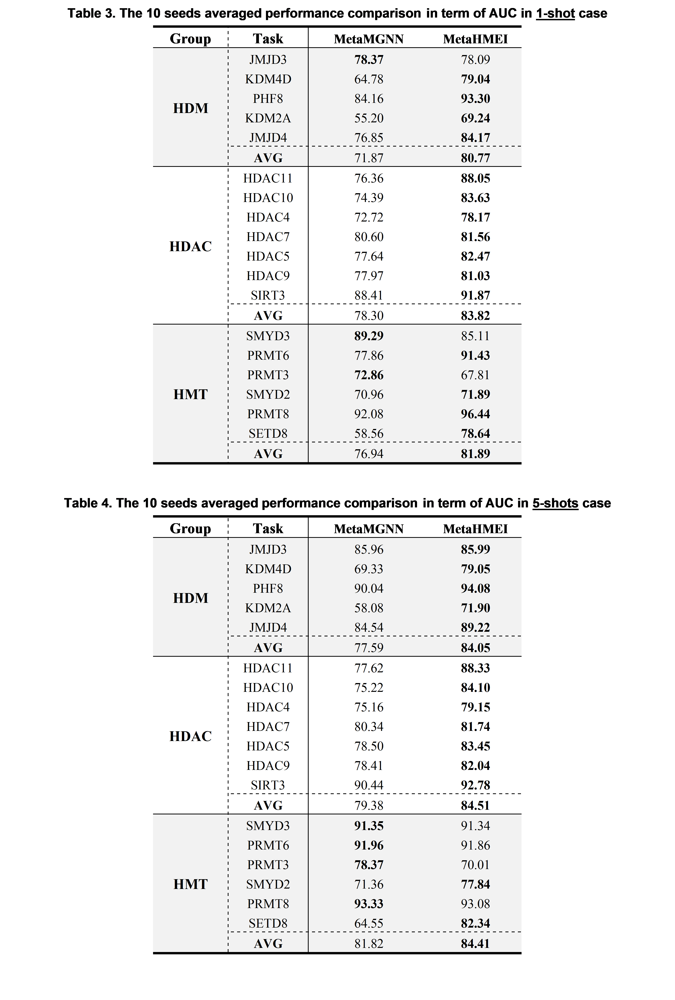

# MetaHMEI: meta-learning for prediction of few-shot histone modifying enzyme inhibitors, Briefings in Bioinformatics, 2023;, bbad115, https://doi.org/10.1093/bib/bbad115

This code is an implementation of our paper " Qi Lu, Ruihan Zhang, Hongyuan Zhou, Dongxuan Ni, Weilie Xiao, Jin Li, MetaHMEI: meta-learning for prediction of few-shot histone modifying enzyme inhibitors, Briefings in Bioinformatics, 2023;, bbad115, https://doi.org/10.1093/bib/bbad115" in PyTorch. In this repository, we provide dataset: HME(KMD,HDAC,HAT,PMT) collected by ourselves

In our problem setting of histone inhibitor activity prediction, the input of our model is the SMILES format of compound and the outputs are not only a binary prediction result of histone inhibitor activity but also the the confidence level of prediction result. The overview of our **MetaHMEI Model** is as follows:


The details of the MetaHMEI Model are described in our paper.
## Characteristics of the repository

- We provide the **several demo-scripts** of the experiments in the paper, so that you can quickly understand the histone inhibitor activity prediction process of the MetaHMEI model.
- This code is **easy to use**. It means that you can customize your own dataset and train your own histone inhibitor activity prediction model, and apply it to the new "histone inhibitor discovery" scenario.


## Requirements

- Pytorch 1.6.0
- Numpy 1.19.4
- Scikit-learn 0.23.2
- RDKit 2020.09.1.0


## (a) Case Study

- Uncomment line 94 and run the script **"main.py"** to get models trained by meta-learning, select the trained model according to the effect of each epoch of iteration for different targets.
- run the script **"predict_JMJD3.py"** to get the top 5000 candidates with high predicted scores
- For the detailed description of this experiment, please refer to **5.7 Case Study** in the paper)


<details>
  <summary>Click here for the results!</summary>

```
top candidates with high predicted scores for JMJD3
+------+----------------------------------------------------------+------------------------+---------------+
| Rank |                          Smiles                          |      Probability       |      Id       |
+------+----------------------------------------------------------+------------------------+---------------+
|  1   | c1(c(nn(c1)C)c1ccc(CNC(=O)CCN2CC(OC(C2)C)C)cc1)c1ccncc1  |          1.0           | BDC 21198071  |
|  2   | C(=O)(C1(Cc2ccc(c3ccncc3)cc2)CCN(Cc2cc(F)ccc2)CC1)NC(C)C |          1.0           | BDC 22448879  |
|  3   |  C1(C(=O)NC)(Cc2ccc(c3cnccc3)cc2)CCN(Cc2ccc(cc2)OC)CC1   |          1.0           | BDC 22449617  |
| ...  |                            ...                           |          ...           |      ...      |

```

</details>


## (b) Training of MetaHIA Model using your dataset and make trustworthy histone inhibitor discoveries

**We recommend you to run "main.py" script to reproduce our experiment before attempting to train the MetaHIA model
using your own dataset to familiarize yourself with the training processes of the MetaHIA.**

**- Step-1: Raw data format**

Please refer to **"dataset/HME/KDM/1/data.csv"** file to store your Compound-Protein pairs in rows according to the
following format "(SMILES of Compound,label)" :

```
------------------------------------------ data.csv ---------------------------------------
+---------------------------------------------+--------------------------------------------+
|                   smiles                    |                      label                 |
+---------------------------------------------+--------------------------------------------+
|             Nc1nc(-c2ccccn2)cs1             |                       0                    |
|             O=CNc1ccc(C(=O)O)cc1O           |                       0                    |
|         CCCCCN(C)CCCCC(=O)N(O)CCC(=O)O      |                       0                    |
|                      ...                    |                      ...                   |
+---------------------------------------------+--------------------------------------------+

Make sure that the smiles with the label 0 comes first and the smiles with the label 1 comes after
```

**- Step-2: Set configuration parameters According to your dataset**

Please refer to line 45-62 of the script **"main.py"** to set the number of training tasks and test tasks for your dataset, then refer to line 5-14 of the script **"samples.py"** to set number of negative and positive examples,finally refer to line 17 of the script **"pretrain_model.py"** to set number of training tasks


**- Step-3: To take full advantage of the meta-training task, we start pre-training**
<span id="jump"></span>

run **"data_process_for_pretrain.py"** to Implement pre-training data processing then run **"pretrain/pretrain.py"** to get pretrained model.

**- Step-4: Meta Training**

Uncomment line 94 and run the file **"main.py"** to train and save your own MetaHIA Model.

**- Step-5: Histone inhibitor discovery**

Your MetaHIA Model can be trained as described above and then refer to **"case_study/predict_JMJD3.py"** for your own **histone inhibitor discovery**！

## Note
Unfortunately, we found that we made a mistake in evaluating MetaMGNN, the code disclosed by the authors of MetaMGNN converts the prediction results into label values with a threshold of 0.5 and calculates AUC, which is different from our method.

We re-ran the experiment after modifying the evaluation method of MetaMGNN to be the same as our method, and the results under averaging of 10 random seeds are shown below, our method achieved the best results in 5 out of 6 cases of 3 histone modifying enzyme group, the conclusion of the paper remains unchanged.


In addition, inspired by transfer learning, we refined our method by adding a pre-training step ([Step-3](#jump)), the results under averaging of 10 random seeds are shown below

Hope our work is helpful to you
## Disclaimer

Please manually verify the reliability of the results by experts before conducting further drug experiments. Do not
directly use these drugs for disease treatment.

## Thanks
Thanks for the support of the following repositories:

| Source |                    Detail                     |
|:------:|:---------------------------------------------:|
| https://github.com/codertimo/BERT-pytorch | Implement of Transformer |
| https://github.com/samoturk/mol2vec | An unsupervised machine learning approach to learn vector representations of molecular substructures |
| https://github.com/zhichunguo/Meta-MGNN |  First meta-learning-based method for molecule properties prediction |


## Cite Us
If you found this work useful to you, please cite our paper:
MetaHMEI: meta-learning for prediction of few-shot histone modifying enzyme inhibitors, Briefings in Bioinformatics, 2023;, bbad115, https://doi.org/10.1093/bib/bbad115
